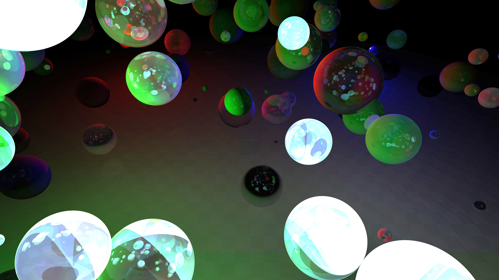

# Parallel CPU RayTracer

Высокопроизводительный программный рендерер на языке C++, реализующий алгоритм обратной трассировки лучей (Ray Tracing) с полной поддержкой многопоточности.

## Особенности проекта
Этот проект представляет собой систему визуализации трехмерных сцен, написанную «с нуля» без использования сторонних графических библиотек для расчетов. Основной упор сделан на математическую точность и эффективную утилизацию ресурсов центрального процессора.

### Ключевые возможности:
- **Многопоточный рендеринг**: распределение вычислений между всеми ядрами CPU с помощью `std::thread`.
- **Динамическая балансировка**: использование атомарных счетчиков (`std::atomic`) для распределения строк кадра между потоками, что исключает простой ядер при неравномерной сложности сцены.
- **Сложная геометрия**: поддержка пересечений с базовыми примитивами (сферы, плоскости, боксы, треугольники) и полигональными сетками.
- **CSG (Constructive Solid Geometry)**: реализация булевых операций над объектами (объединение, вычитание, пересечение) для создания сложных форм.
- **Физика света**: 
    - Рекурсивные отражения и преломления (закон Снеллиуса).
    - Учет коэффициентов преломления сред.
    - Экспоненциальное затухание света внутри прозрачных объектов.
- **Форматы данных**: собственный парсер двоичного формата моделей `.g3dm` и экспорт готового изображения в формат `.tga` с сохранением метаданных о времени рендеринга.

## Технологический стек
- **Язык**: C++17.
- **Параллелизм**: `std::thread`, `std::atomic`.
- **Математика**: собственная библиотека линейной алгебры (векторы, матрицы, лучи).
- **UI**: WinAPI (для отображения окна и обработки событий).

## Структура проекта
```
├── src
│   ├── def.h
│   ├── gort.cpp
│   ├── gort.h
│   ├── mth — библиотека математических типов и функций.
│   │   ├── mth_cam.h
│   │   ├── mth_def.h
│   │   ├── mth.h
│   │   └── ...
│   ├── ray
│   │   ├── frame.h — управление буфером кадра и экспорт в TGA.
│   │   ├── lgh — модели источников света (точечные, направленные).
│   │   │   ├── dir.h
│   │   │   ├── lights.h
│   │   │   └── point.h
│   │   ├── rt_def.h
│   │   ├── rt.h
│   │   ├── rt_scene.cpp
│   │   ├── rt_scene.h
│   │   ├── rt_win.h — основной цикл рендеринга и управление потоками.
│   │   ├── shp — реализация геометрических объектов и алгоритмов пересечения.
│   │   │   ├── box.h
│   │   │   ├── csg.h
│   │   │   ├── g3dm.h
│   │   │   ├── plane.h
│   │   │   └── ...
│   │   └── timer.h
│   └── win — основная работа с окном
│       ├── main.cpp
│       ├── win.h
│       └── win_msg.cpp
└── win.cpp
```
## Установка и сборка
Проект ориентирован на компиляцию в среде Windows (используется WinAPI).

1. Клонируйте репозиторий:
   ```bash
   git clone https://github.com/VG6VG6/SUMCAMP2024.git
   ```
2. Откройте проект в Visual Studio или любой другой компилятор C++, но тогда необходимо будет настроить зависимости.
3. Соберите проект в конфигурации **Release** для максимальной производительности (важно, т.к. в **Debug** для трассировки выделяетсся лишь 1 поток).

## Галерея



